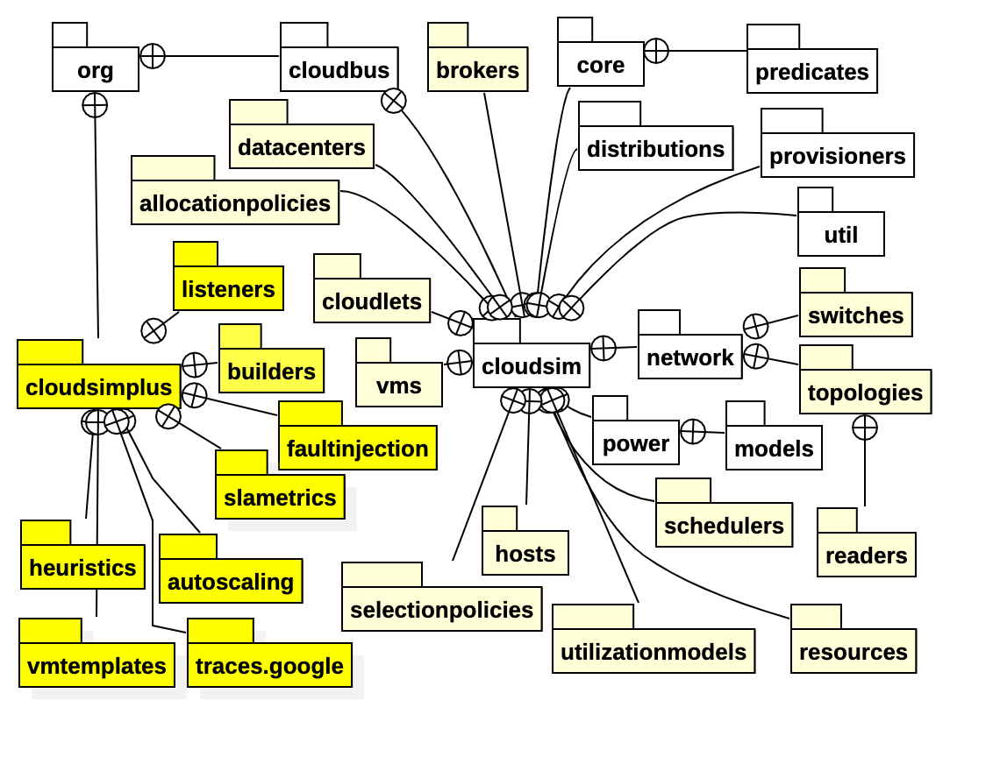

Name: Thiruvenkadam Sivaprakasam Radhakrishnan

## CloudOrg Simulator

### **Introduction**

In this project, we are using the CloudSimPlus library that is built on top of the CloudSim framework to simulate our 
own Cloud organization. We try to understand the different components that make up the infrastructure in a cloud organization
and also use various scheduling, allocation and other algorithms to optimize the performance of 
the different components in the cloud infrastructure (physical or virtual).

### Cloud Infrastructure

The Cloud infrastructure is structured as follows - 

**Source: https://cloudsimplus.org/*

The main components we use in creating our simulation are - datacenters, hosts, vms and cloudlets. A cloud organization
can have one or more _datacenters_ spread across different geographies to serve its customers in different locations. The cloudsimplus
framework allows us to specify various characteristics of a datacenter down to the edges, switches and network topology of how the physical
devices are connected to each other, also including the number of _hosts_ (physical machines), the architecture, operating system of these machines etc.
A datacenter contains host machines which are physical machines that are used to perform the computation tasks sent to the datacenter. The framework also
allows us to specify the configurations of these host machines such as - mipsCapacity, PEs, RAM, Storage and Bandwidth.

Apart from these physical entities, we also have _Virtual machines_ that gets created and allocated within these physical host machines and _Cloudlets_ that
represent the task that needs to be executed on the cloud infrastructure.

### Simulation

The project is structured as follows:

1. We have the main _Simulation_ class that contains the main function and initiates the simulation
2. The core of the simulation is give _CloudOrgSim_ object that contains abstract function implementations to create the resources that simulate the cloud infrastructure
3. Next, we have the config file _application.conf_ that provides all the parameters for the simulation that are fed into the _CloudOrgSim_ object to create the resources 
upon execution
4. We also have some helper classes to read the config, log messages etc.

#### Simulation Results

The simulation that comes with the repo contains the following configuration:

* There are three datacenters each belonging to different timezones
  * Each datacenter contains 4 Hosts with their resources available specified in the configuration (PEs, RAM, Storage, Mips, BW etc.)
  * VM Allocation and VM Scheduling policies can be configured
* There are 4 VMs. Timezone and scheduling policy of the VMs can be configured
* There are 40 Cloudlets that are submitted to the broker (creating and assigning VMs to Hosts and Cloudlets to Vms on behalf of the customer)
  * The cloudlet resource requirements and utilization model can be specified in the configuration
  * The broker can also be configured to be location aware (i.e. assign VMs to the closest datacenter host based on timezone)

These configurations can be modified to run different experiments to decide on the best allocation and scheduling policies that can be used for a 
specific scenario or for a generic cloud consumer. The framework also provides many more classes and implementations to explore such as - VM migration, autoscaling,
simulating based on traces from cloud platforms to name a few, to optimize costs.

Further details of simulation results can be found under the [docs](/docs) folder.

#### Running the simulation

You can run the simulation using one of the following methods:

Clone/Fork this repository.

###### Using IntelliJ
* Install the [Intellij](https://www.jetbrains.com/idea/) IDE and the Scala plugin
* Import project folder into IntelliJ
* Add Configurations to run the project as an _SBT Task_ (Add "~run" to the tasks field when editing the configuration)
* Run the project

###### Using SBT
* Install [Scala]((**https://www.scala-lang.org/download/scala3.html**)) using SBT following the instructions from the link
* Open a command prompt and navigate to the project folder
* Run the following command - "sbt run" _(make sure that sbt is added to your environment path)_

